# 🤖 CSV-Agent: Chat with your CSVs! 📊

[](https://www.python.org/)
[](https://pandas.pydata.org/)
[](https://www.langchain.com/)
[](https://groq.com/)

Tired of writing `pandas` code for every simple query? **CSV-Agent** is your personal data analyst, powered by Large Language Models. Just ask questions in plain English and get insights from your CSV files instantly! 🚀

<!-- TODO: Replace this with a real GIF of your project in action! -->
!CSV-Agent in Action

---

## ✨ Features

*   **💬 Natural Language Queries**: Just talk to your data. No code required!
*   **🧠 Smart Analysis**: Understands context to perform filtering, sorting, aggregation, and more.
*   **📈 Statistical Summaries**: Get quick stats (`mean`, `min`, `max`, etc.) on any column.
*   **🔍 Data Exploration**: Easily find columns with missing values or check data types.
*   **⚡ Blazing Fast**: Powered by the Groq LPU™ Inference Engine for near-instant responses.

---

## 🛠️ How It Works

The agent follows a simple yet powerful workflow to answer your questions.

```mermaid
graph TD
    A[👤 You] -- "Which columns have missing values?" --> B(🤖 CSV Agent);
    B -- "Generates Python code" --> C(🧠 LLM @ Groq);
    C -- "df.isnull().sum()" --> D(🐼 Pandas Executor);
    D -- "{'age': 177, 'embarked': 2, ...}" --> B;
    B -- "The columns with missing values are..." --> A;
```



---

## 🚀 Getting Started

Get your own CSV-Agent running in just a few minutes.

### 1. Prerequisites

*   Python 3.9+
*   An API key from GroqCloud

### 2. Installation

```bash
# 1. Clone the repository
git clone https://github.com/your-username/csv-agent.git
cd csv-agent

# 2. Create and activate a virtual environment
python -m venv .venv
source .venv/bin/activate  # On Windows, use `.venv\Scripts\activate`

# 3. Install the required packages
pip install -r requirements.txt

# 4. Set up your environment variables
#    Create a .env file from the existing one (which you should not commit)
#    and add your Groq API key.
echo "GROQ_API_KEY=gsk_..." > .env
```

### 3. Running the Agent

Fire up the agent and start asking questions!

```bash
# Run the main application
python main.py

# You will be prompted to enter your question.
# Example: "How many people survived?"
```

---

## 🧪 Mini-Eval

We have a small evaluation script to quickly test the agent's core capabilities.

```bash
python mini_eval.py
```

You should see an output like this:

```text
[OK] Which columns have missing values?
The columns with missing values are: age, embarked, deck, embark_town

[OK] Show me the first 3 columns with their data types.
The first 3 columns with their data types are:
- survived: int64
- pclass: int64
- sex: object

[OK] Give me a statistical summary of the 'age' column.
Here is a statistical summary of the 'age' column:
- mean: 29.699118
- min: 0.42
- max: 80.0

Passed 3/3
```

---

## 🤝 Contributing

Contributions are what make the open-source community such an amazing place to learn, inspire, and create. Any contributions you make are **greatly appreciated**.

1.  Fork the Project
2.  Create your Feature Branch (`git checkout -b feature/AmazingFeature`)
3.  Commit your Changes (`git commit -m 'Add some AmazingFeature'`)
4.  Push to the Branch (`git push origin feature/AmazingFeature`)
5.  Open a Pull Request

---

## 📜 License

Distributed under the MIT License. See `LICENSE` for more information.

---

<p align="center">
  Made with ❤️ and a lot of ☕
</p>
